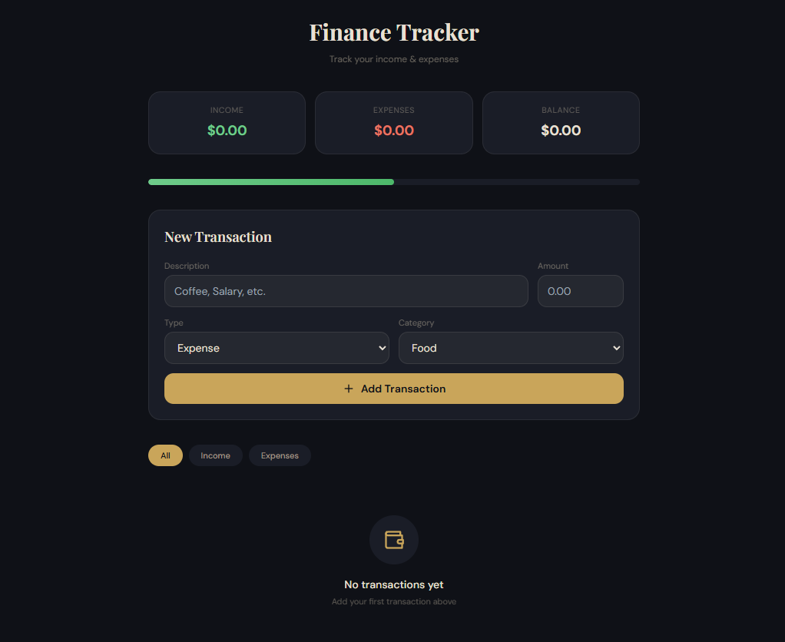

# Finance Tracker

A sleek and simple personal finance tracker that allows users to log income and expenses, monitor their balance in real time, and organize transactions by category using a modern dark interface.

---

## Preview



---

## Overview

Finance Tracker is a lightweight budgeting tool designed to help users manage their daily finances easily. It provides a clear overview of income, expenses, and net balance while allowing quick transaction entry and filtering.

The goal of this project is to create a clean and minimal finance management tool that is easy to use and visually appealing.

---

## Features

- **Live Balance Summary**
  - Displays total income
  - Displays total expenses
  - Calculates net balance automatically

- **Quick Transaction Entry**
  - Add transaction description
  - Enter amount
  - Select transaction type (Income or Expense)
  - Choose categories like Food, Transport, Salary, etc.

- **Transaction Filtering**
  - View all transactions
  - Filter by income
  - Filter by expenses

- **Visual Balance Indicator**
  - Progress bar showing financial balance at a glance

- **Persistent Data Storage**
  - Saves transaction data so nothing gets lost

- **Modern Dark UI**
  - Clean, elegant interface for better user experience

---

## Use Cases

This project can be used for:

- Personal budgeting
- Tracking daily expenses
- Monitoring monthly income
- Basic financial planning

---

## Future Improvements

- Monthly reports and analytics
- Charts and spending insights
- Export transactions to CSV
- Budget limits and alerts
- Mobile responsiveness improvements
- Multi-user authentication

---

## Getting Started

1. Clone the repository

```
git clone https://github.com/your-username/finance-tracker.git
```

2. Navigate to the project folder

```
cd finance-tracker
```

3. Open the project in your browser or development environment.

---

## License

This project is open-source and available for learning and personal use.
